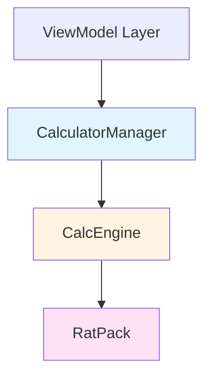
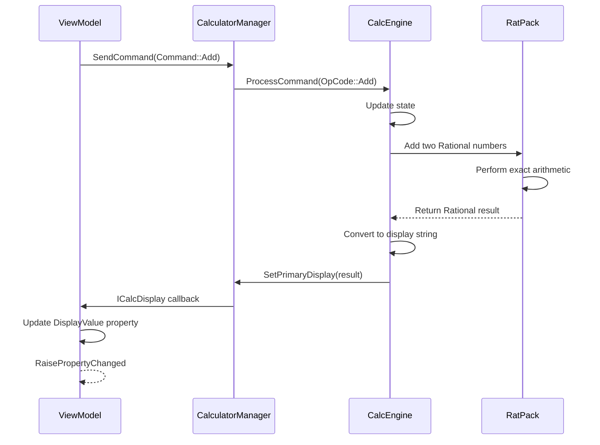

The Model layer is contained in the **CalcManager project** and provides the core calculation logic for Windows Calculator. It operates independently of the UI, making it reusable and testable.

## Three-Tier Architecture

The Model consists of three distinct layers, each with specific responsibilities:



<Steps>
  <Step title="CalculatorManager">
    High-level API managing calculator modes, history, and memory
  </Step>
  <Step title="CalcEngine">
    Core calculation logic interpreting operations and maintaining state
  </Step>
  <Step title="RatPack">
    Low-level rational number arithmetic with infinite precision
  </Step>
</Steps>

## Layer 1: CalculatorManager

<Info>
**Location**: `src/CalcManager/CalculatorManager.h`

CalculatorManager is the **entry point** to the Model layer. ViewModels interact exclusively with this class.
</Info>

### Responsibilities

- Manage calculator modes (Standard, Scientific, Programmer)
- Maintain calculation history for each mode
- Handle memory operations (M+, M-, MC, MR, MS)
- Switch between different `CalcEngine` instances
- Implement `ICalcDisplay` to communicate with ViewModels

### Calculator Modes

<CodeGroup>
```cpp CalculatorManager.h Mode Enumeration (src/CalcManager/CalculatorManager.h:17-20)
enum class CalculatorMode
{
    Standard = 0,
    Scientific,
};
```
</CodeGroup>

<Note>
Programmer mode is handled through a separate engine instance, though not explicitly enumerated here.
</Note>

### Multiple Engine Instances

CalculatorManager maintains **separate engine instances** for each mode:

<CodeGroup>
```cpp CalculatorManager.h Engine Instances (src/CalcManager/CalculatorManager.h:46-52)
private:
    ICalcDisplay* const m_displayCallback;
    CCalcEngine* m_currentCalculatorEngine;
    std::unique_ptr<CCalcEngine> m_scientificCalculatorEngine;
    std::unique_ptr<CCalcEngine> m_standardCalculatorEngine;
    std::unique_ptr<CCalcEngine> m_programmerCalculatorEngine;
    IResourceProvider* const m_resourceProvider;
```
</CodeGroup>

<Tip>
Each mode has its own engine instance, preserving the calculation state when switching between modes.
</Tip>

### Memory Management

<Tabs>
  <Tab title="Memory Storage">
    ```cpp CalculatorManager.h Memory (src/CalcManager/CalculatorManager.h:47,56)
    static const unsigned int m_maximumMemorySize = 100;
    std::vector<CalcEngine::Rational> m_memorizedNumbers;
    ```
    
    Calculator can store up to **100 memory values** using rational numbers.
  </Tab>
  
  <Tab title="Memory Commands">
    ```cpp CalculatorManager.h Memory Commands (src/CalcManager/CalculatorManager.h:34-42)
    enum class MemoryCommand
    {
        MemorizeNumber = 330,
        MemorizedNumberLoad = 331,
        MemorizedNumberAdd = 332,
        MemorizedNumberSubtract = 333,
        MemorizedNumberClearAll = 334,
        MemorizedNumberClear = 335
    };
    ```
  </Tab>
  
  <Tab title="Memory Methods">
    ```cpp CalculatorManager.h Public Methods (src/CalcManager/CalculatorManager.h:94-99)
    void MemorizeNumber();
    void MemorizedNumberLoad(_In_ unsigned int);
    void MemorizedNumberAdd(_In_ unsigned int);
    void MemorizedNumberSubtract(_In_ unsigned int);
    void MemorizedNumberClear(_In_ unsigned int);
    void MemorizedNumberClearAll();
    ```
  </Tab>
</Tabs>

### History Management

CalculatorManager maintains **separate history** for Standard and Scientific modes:

<CodeGroup>
```cpp CalculatorManager.h History (src/CalcManager/CalculatorManager.h:66-68)
private:
    std::shared_ptr<CalculatorHistory> m_pStdHistory;
    std::shared_ptr<CalculatorHistory> m_pSciHistory;
    CalculatorHistory* m_pHistory;
```
</CodeGroup>

History operations:

```cpp CalculatorManager.h History API (src/CalcManager/CalculatorManager.h:110-119)
std::vector<std::shared_ptr<HISTORYITEM>> const& GetHistoryItems() const;
std::vector<std::shared_ptr<HISTORYITEM>> const& GetHistoryItems(_In_ CalculatorMode mode) const;
void SetHistoryItems(_In_ std::vector<std::shared_ptr<HISTORYITEM>> const& historyItems);
std::shared_ptr<HISTORYITEM> const& GetHistoryItem(_In_ unsigned int uIdx);
bool RemoveHistoryItem(_In_ unsigned int uIdx);
void ClearHistory();
size_t MaxHistorySize() const
{
    return m_pHistory->MaxHistorySize();
}
```

### ICalcDisplay Interface

CalculatorManager implements `ICalcDisplay` to communicate results back to ViewModels:

<CodeGroup>
```cpp CalculatorManager.h ICalcDisplay Implementation (src/CalcManager/CalculatorManager.h:71-85)
public:
    // ICalcDisplay
    void SetPrimaryDisplay(_In_ const std::wstring& displayString, _In_ bool isError) override;
    void SetIsInError(bool isError) override;
    void SetExpressionDisplay(
        _Inout_ std::shared_ptr<std::vector<std::pair<std::wstring, int>>> const& tokens,
        _Inout_ std::shared_ptr<std::vector<std::shared_ptr<IExpressionCommand>>> const& commands) override;
    void SetMemorizedNumbers(_In_ const std::vector<std::wstring>& memorizedNumbers) override;
    void OnHistoryItemAdded(_In_ unsigned int addedItemIndex) override;
    void SetParenthesisNumber(_In_ unsigned int parenthesisCount) override;
    void OnNoRightParenAdded() override;
    void DisplayPasteError();
    void MaxDigitsReached() override;
    void BinaryOperatorReceived() override;
    void MemoryItemChanged(unsigned int indexOfMemory) override;
    void InputChanged() override;
```
</CodeGroup>

<Info>
When the engine needs to update the display, it calls these interface methods, which the ViewModel implements.
</Info>

### Mode Switching

```cpp CalculatorManager.h Mode Methods (src/CalcManager/CalculatorManager.h:88-91)
void SetStandardMode();
void SetScientificMode();
void SetProgrammerMode();
```

These methods switch `m_currentCalculatorEngine` to the appropriate engine instance.

## Layer 2: CalcEngine

<Info>
**Location**: `src/CalcManager/Header Files/CalcEngine.h`

CalcEngine is the **calculation state machine**. It interprets operations, maintains the calculation state, and performs mathematical operations.
</Info>

### Core Functionality

<Tabs>
  <Tab title="State Management">
    CalcEngine maintains calculation state:
    
    ```cpp CalcEngine.h State Variables (src/CalcManager/Header Files/CalcEngine.h:114-137)
    bool m_bRecord;                // Recording or displaying mode
    CalcEngine::CalcInput m_input; // Input object for decimal strings
    NumberFormat m_nFE;            // Scientific notation flag
    
    CalcEngine::Rational m_currentVal;  // Currently displayed number
    CalcEngine::Rational m_lastVal;     // Number before operation (left operand)
    CalcEngine::Rational m_holdVal;     // For repetitive calculations (pressing "=" continuously)
    
    std::array<CalcEngine::Rational, MAXPRECDEPTH> m_parenVals;      // Parenthesis values
    std::array<CalcEngine::Rational, MAXPRECDEPTH> m_precedenceVals; // Precedence values
    
    bool m_bError;        // Error flag
    bool m_bInv;          // Inverse on/off flag
    bool m_bNoPrevEqu;    // Previous equals flag
    ```
  </Tab>
  
  <Tab title="Precision & Radix">
    ```cpp CalcEngine.h Precision Settings (src/CalcManager/CalculatorManager.h:22-27)
    enum class CalculatorPrecision
    {
        StandardModePrecision = 16,
        ScientificModePrecision = 32,
        ProgrammerModePrecision = 64
    };
    ```
    
    ```cpp CalcEngine.h Radix Variables (src/CalcManager/Header Files/CalcEngine.h:139-142)
    uint32_t m_radix;          // Current radix (2, 8, 10, 16)
    int32_t m_precision;       // Decimal precision
    int m_cIntDigitsSav;
    std::vector<uint32_t> m_decGrouping; // Decimal digit grouping
    ```
  </Tab>
  
  <Tab title="Programmer Mode">
    ```cpp CalcEngine.h Programmer Mode (src/CalcManager/Header Files/CalcEngine.h:33-40,152-154)
    enum class NUM_WIDTH
    {
        QWORD_WIDTH, // 64 bits (default)
        DWORD_WIDTH, // 32 bits
        WORD_WIDTH,  // 16 bits
        BYTE_WIDTH   // 8 bits
    };
    
    AngleType m_angletype;       // Deg, rad, or grad
    NUM_WIDTH m_numwidth;        // Word size
    int32_t m_dwWordBitWidth;    // # of bits in selected word size
    ```
  </Tab>
</Tabs>

### Constructor

<CodeGroup>
```cpp CalcEngine.h Constructor (src/CalcManager/Header Files/CalcEngine.h:56-61)
CCalcEngine(
    bool fPrecedence,
    bool fIntegerMode,
    CalculationManager::IResourceProvider* const pResourceProvider,
    __in_opt ICalcDisplay* pCalcDisplay,
    __in_opt std::shared_ptr<IHistoryDisplay> pHistoryDisplay
);
```
</CodeGroup>

- `fPrecedence`: Enable operator precedence (true for Scientific mode)
- `fIntegerMode`: Restrict to integer operations (true for Programmer mode)
- `pCalcDisplay`: Callback interface for display updates
- `pHistoryDisplay`: Callback for history updates

### Command Processing

<CodeGroup>
```cpp CalcEngine.h Command Processing (src/CalcManager/Header Files/CalcEngine.h:62)
void ProcessCommand(OpCode wID);
```
</CodeGroup>

This is the **main entry point** for all calculator operations. It:
1. Receives an operation code (button press)
2. Updates the calculation state
3. Performs calculations if needed
4. Calls `ICalcDisplay` methods to update the UI

### Display Formatting

```cpp CalcEngine.h Display Methods (src/CalcManager/Header Files/CalcEngine.h:80-88)
uint32_t GetCurrentRadix();
std::wstring GetCurrentResultForRadix(uint32_t radix, int32_t precision, bool groupDigitsPerRadix);
std::wstring GroupDigitsPerRadix(std::wstring_view numberString, uint32_t radix);
std::wstring GetStringForDisplay(CalcEngine::Rational const& rat, uint32_t radix);
void UpdateMaxIntDigits();
wchar_t DecimalSeparator() const;
```

These methods convert internal `Rational` values into formatted strings for different radixes.

### History Collection

```cpp CalcEngine.h History (src/CalcManager/Header Files/CalcEngine.h:92,161)
std::vector<std::shared_ptr<IExpressionCommand>> GetHistoryCollectorCommandsSnapshot() const;

private:
    CHistoryCollector m_HistoryCollector; // Accumulator of each line of history
```

<Note>
The `CHistoryCollector` accumulates operations as they occur, building up history items.
</Note>

### State Checking

```cpp CalcEngine.h State Methods (src/CalcManager/Header Files/CalcEngine.h:66-77)
bool FInErrorState()
{
    return m_bError;
}
bool IsInputEmpty()
{
    return m_input.IsEmpty() && (m_numberString.empty() || m_numberString == L"0");
}
bool FInRecordingState()
{
    return m_bRecord;
}
```

## Layer 3: RatPack

<Info>
**Location**: `src/CalcManager/Ratpack/ratpak.h`

RatPack (Rational Pack) is the **mathematical core** providing infinite precision arithmetic using rational numbers.
</Info>

### Infinite Precision Arithmetic

<Warning>
RatPack uses **arbitrary-precision arithmetic** instead of floating-point, avoiding rounding errors inherent in IEEE 754 floating-point.
</Warning>

Instead of storing numbers as `double` or `float`, RatPack represents them as:

```
Rational Number = numerator / denominator
```

Both numerator and denominator can be arbitrarily large integers, limited only by available memory.

### Rational Number Structure

Numbers are stored using the `Rational` type:

```cpp CalcEngine.h Rational Usage (src/CalcManager/Header Files/CalcEngine.h:127-134)
std::unique_ptr<CalcEngine::Rational> m_memoryValue; // Memory value

CalcEngine::Rational m_holdVal;     // Second operand holder
CalcEngine::Rational m_currentVal;  // Currently displayed number
CalcEngine::Rational m_lastVal;     // Left operand

std::array<CalcEngine::Rational, MAXPRECDEPTH> m_parenVals;
std::array<CalcEngine::Rational, MAXPRECDEPTH> m_precedenceVals;
```

### Benefits of Rational Arithmetic

<CardGroup cols={2}>
  <Card title="Exact Results" icon="bullseye">
    Operations like 0.1 + 0.2 produce exactly 0.3, not 0.30000000000000004
  </Card>
  <Card title="No Rounding Errors" icon="circle-check">
    Fractions like 1/3 are stored exactly, not approximated
  </Card>
  <Card title="Infinite Precision" icon="infinity">
    Can represent numbers with thousands of digits
  </Card>
  <Card title="Deterministic" icon="equals">
    Same inputs always produce identical outputs
  </Card>
</CardGroup>

### Mathematical Operations

RatPack provides operations on rational numbers:

- Basic arithmetic: add, subtract, multiply, divide
- Comparisons: equal, less than, greater than
- Transcendental functions: sin, cos, tan, log, exp
- Special operations: factorial, power, root

```cpp CalcEngine.h Operations (src/CalcManager/Header Files/CalcEngine.h:181-182)
CalcEngine::Rational SciCalcFunctions(CalcEngine::Rational const& rat, uint32_t op);
CalcEngine::Rational DoOperation(int operation, CalcEngine::Rational const& lhs, CalcEngine::Rational const& rhs);
```

## Data Flow Through Model Layers

Here's how a calculation flows through all three layers:



<Steps>
  <Step title="ViewModel → CalculatorManager">
    ViewModel calls `SendCommand()` with an operation
  </Step>
  <Step title="CalculatorManager → CalcEngine">
    Forwards command to active engine's `ProcessCommand()`
  </Step>
  <Step title="CalcEngine → RatPack">
    Engine calls RatPack functions to perform exact arithmetic
  </Step>
  <Step title="RatPack → CalcEngine">
    Returns result as a Rational number
  </Step>
  <Step title="CalcEngine → CalculatorManager">
    Converts to display string and calls `SetPrimaryDisplay()`
  </Step>
  <Step title="CalculatorManager → ViewModel">
    Callback updates ViewModel property
  </Step>
</Steps>

## Example: Adding Two Numbers

<Tabs>
  <Tab title="User Action">
    User presses: **5 + 3 =**
  </Tab>
  
  <Tab title="ViewModel">
    ```cpp
    // Button presses trigger commands
    vm->OnButtonPressed(Command::Five);
    vm->OnButtonPressed(Command::Add);
    vm->OnButtonPressed(Command::Three);
    vm->OnButtonPressed(Command::Equals);
    ```
  </Tab>
  
  <Tab title="CalculatorManager">
    ```cpp
    // Forwards to active engine
    void CalculatorManager::SendCommand(Command command)
    {
        m_currentCalculatorEngine->ProcessCommand(
            static_cast<OpCode>(command)
        );
    }
    ```
  </Tab>
  
  <Tab title="CalcEngine">
    ```cpp
    // Maintains state and performs operation
    void CCalcEngine::ProcessCommand(OpCode wID)
    {
        // On '5': m_currentVal = Rational(5, 1)
        // On '+': m_lastVal = m_currentVal, m_nOpCode = Add
        // On '3': m_currentVal = Rational(3, 1)
        // On '=': 
        m_currentVal = DoOperation(
            m_nOpCode,      // Add
            m_lastVal,      // 5/1
            m_currentVal    // 3/1
        );
        // Result: m_currentVal = 8/1
        DisplayNum();
    }
    ```
  </Tab>
  
  <Tab title="RatPack">
    ```cpp
    // Exact rational arithmetic
    Rational DoOperation(int op, Rational lhs, Rational rhs)
    {
        // Add: (a/b) + (c/d) = (ad + bc) / (bd)
        // (5/1) + (3/1) = (5*1 + 3*1) / (1*1) = 8/1
        return RationalAdd(lhs, rhs);
    }
    ```
  </Tab>
</Tabs>

## Best Practices

<AccordionGroup>
  <Accordion title="Use CalculatorManager API">
    ViewModels should only interact with `CalculatorManager`, never directly with `CalcEngine` or RatPack.
  </Accordion>
  
  <Accordion title="Implement ICalcDisplay">
    ViewModels must implement `ICalcDisplay` to receive calculation results from the Model.
  </Accordion>
  
  <Accordion title="Preserve Engine State">
    Each calculator mode has its own engine instance to preserve state when switching modes.
  </Accordion>
  
  <Accordion title="Leverage Rational Precision">
    Use RatPack's infinite precision for exact calculations, converting to display strings only when needed.
  </Accordion>
</AccordionGroup>

## Testing the Model

<Tip>
The Model layer is highly testable because it has no UI dependencies:

```cpp Example Test
// Create manager with mock display
CalculatorManager manager(&mockDisplay, &resourceProvider);

// Perform calculation
manager.SendCommand(Command::Five);
manager.SendCommand(Command::Add);
manager.SendCommand(Command::Three);
manager.SendCommand(Command::Equals);

// Verify display callback received "8"
Assert::AreEqual(L"8", mockDisplay.GetLastDisplayString());
```
</Tip>

## Next Steps

<CardGroup cols={3}>
  <Card title="ViewModel Layer" icon="circle-nodes" href="./viewmodel-layer">
    See how ViewModels call into CalculatorManager
  </Card>
  <Card title="Architecture Overview" icon="sitemap" href="./overview">
    Review the complete architecture
  </Card>
  <Card title="MVVM Pattern" icon="diagram-project" href="./mvvm-pattern">
    Understand how Model fits into MVVM
  </Card>
</CardGroup>