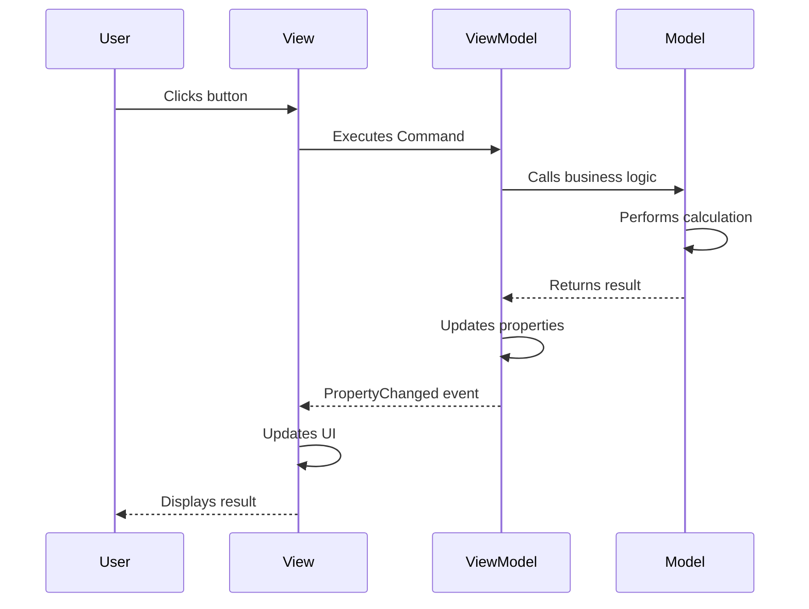
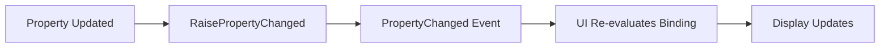

Windows Calculator implements the **Model-View-ViewModel (MVVM)** design pattern to achieve clean separation between the user interface and business logic. This pattern enables testability, maintainability, and a clear data flow throughout the application.

## What is MVVM?

MVVM divides the application into three distinct layers:

<CardGroup cols={3}>
  <Card title="Model" icon="database">
    Business logic and data
  </Card>
  <Card title="View" icon="display">
    User interface (XAML)
  </Card>
  <Card title="ViewModel" icon="arrows-left-right">
    Mediator exposing Model data to View
  </Card>
</CardGroup>

## The Three Layers

### Model

<Info>
The Model layer contains pure business logic with **no knowledge of the UI**. It's responsible for calculations, data storage, and core application functionality.
</Info>

In Calculator, the Model is the `CalcManager` project with three components:

- **CalculatorManager** - Manages calculator modes, history, and memory
- **CalcEngine** - Performs calculations and maintains state
- **RatPack** - Provides infinite precision arithmetic

### View

The View layer consists of **XAML files** that define the visual interface. Views should contain minimal code-behind logic.

<CodeGroup>
```xml MainPage.xaml
<Page x:Class="CalculatorApp.MainPage"
      xmlns="http://schemas.microsoft.com/winfx/2006/xaml/presentation"
      xmlns:x="http://schemas.microsoft.com/winfx/2006/xaml">
    <Grid>
        <!-- UI elements bind to ViewModel properties -->
    </Grid>
</Page>
```
</CodeGroup>

### ViewModel

ViewModels expose data from the Model in a format suitable for the View. They:
- Implement `INotifyPropertyChanged` for data binding
- Expose commands for user actions
- Transform Model data for display
- Contain no UI-specific code

## Data Flow

The following diagram shows how data flows through the MVVM layers:



## ViewModel Hierarchy

Calculator's ViewModels form a hierarchy matching the View structure:

```
ApplicationViewModel (MainPage)
├── StandardCalculatorViewModel (Calculator.xaml)
├── DateCalculatorViewModel (DateCalculator.xaml)
└── UnitConverterViewModel (UnitConverter.xaml)
```

### ApplicationViewModel

<Tabs>
  <Tab title="Overview">
    `ApplicationViewModel` is the root ViewModel corresponding to `MainPage.xaml`. It manages mode switching and coordinates child ViewModels.
    
    **Location**: `src/CalcViewModel/ApplicationViewModel.h`
  </Tab>
  
  <Tab title="Responsibilities">
    - Maintains the current calculator mode
    - Initializes mode-specific ViewModels
    - Manages navigation between modes
    - Exposes the active ViewModel to the View
  </Tab>
</Tabs>

### Mode-Specific ViewModels

<AccordionGroup>
  <Accordion title="StandardCalculatorViewModel">
    Supports Standard, Scientific, and Programmer calculator modes.
    
    **Location**: `src/CalcViewModel/StandardCalculatorViewModel.h`
    
    Key features:
    - Display value management
    - Expression tokens for display
    - History and memory management
    - Button command handlers
  </Accordion>
  
  <Accordion title="DateCalculatorViewModel">
    Handles date difference and date addition/subtraction calculations.
    
    **Location**: `src/CalcViewModel/DateCalculatorViewModel.h`
  </Accordion>
  
  <Accordion title="UnitConverterViewModel">
    Manages all unit conversion modes including currency.
    
    **Location**: `src/CalcViewModel/UnitConverterViewModel.h`
  </Accordion>
</AccordionGroup>

## Benefits of MVVM in Calculator

<CardGroup cols={2}>
  <Card title="Testability" icon="vial">
    ViewModels can be tested without UI, enabling comprehensive unit tests for business logic.
  </Card>
  
  <Card title="Separation of Concerns" icon="layer-group">
    UI designers work on XAML while developers focus on ViewModels and Models independently.
  </Card>
  
  <Card title="Reusability" icon="recycle">
    ViewModels can be reused across different Views or platforms.
  </Card>
  
  <Card title="Maintainability" icon="wrench">
    Clear boundaries make the codebase easier to understand and modify.
  </Card>
</CardGroup>

## Data Binding

MVVM relies heavily on data binding to connect Views and ViewModels:

```xml Example: Binding in Calculator.xaml
<ItemsControl ItemsSource="{Binding ExpressionTokens}">
    <!-- Automatically updates when ExpressionTokens changes -->
</ItemsControl>
```

<Note>
Calculator prefers `x:Bind` over `Binding` for better performance. See [Data Binding](/architecture/viewmodel-layer#data-binding-flow) for details.
</Note>

## Command Pattern

User actions trigger commands defined in ViewModels:

```xml Button Command Binding
<Button Command="{x:Bind Model.CopyCommand}"/>
```

The ViewModel defines the command implementation:

```cpp StandardCalculatorViewModel.h
COMMAND_FOR_METHOD(CopyCommand, StandardCalculatorViewModel::OnCopyCommand);
```

<Tip>
The `COMMAND_FOR_METHOD` macro simplifies command creation by generating the necessary boilerplate code.
</Tip>

## Property Change Notifications

When ViewModel properties change, the UI automatically updates through the `INotifyPropertyChanged` interface:



See the [ViewModel Layer](/architecture/viewmodel-layer#propertychanged-events) documentation for implementation details.

## Best Practices

<Warning>
**Do not reference UI elements in ViewModels.** ViewModels should have no knowledge of XAML controls or the View layer.
</Warning>

<Steps>
  <Step title="Keep Views Simple">
    XAML should be declarative. Move complex logic to ViewModels.
  </Step>
  
  <Step title="Use Data Binding">
    Prefer data binding over code-behind event handlers.
  </Step>
  
  <Step title="Observable Properties">
    Use `OBSERVABLE_PROPERTY_RW` for properties that trigger UI updates.
  </Step>
  
  <Step title="Commands for Actions">
    Expose user actions as commands, not public methods.
  </Step>
</Steps>

## Example: Display Value Flow

Here's how a calculation result flows through MVVM:

1. **User** presses the "=" button
2. **View** (Calculator.xaml) executes `ButtonPressed` command
3. **ViewModel** (StandardCalculatorViewModel) processes the command
4. **ViewModel** calls **Model** (CalculatorManager)
5. **Model** performs calculation via CalcEngine
6. **Model** returns result to ViewModel
7. **ViewModel** updates `DisplayValue` property
8. `RaisePropertyChanged("DisplayValue")` fires
9. **View** receives PropertyChanged event
10. UI binding re-evaluates and updates display

## Next Steps

<CardGroup cols={3}>
  <Card title="View Layer" icon="window" href="./view-layer">
    Explore XAML implementation
  </Card>
  <Card title="ViewModel Layer" icon="circle-nodes" href="./viewmodel-layer">
    Deep dive into ViewModels
  </Card>
  <Card title="Model Layer" icon="gears" href="./model-layer">
    Understand the calculation engine
  </Card>
</CardGroup>