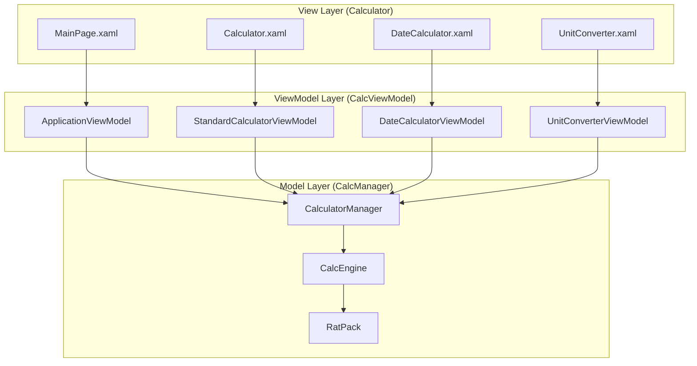

Windows Calculator is a **C++/CX** application built for the Universal Windows Platform (UWP). The application follows the Model-View-ViewModel (MVVM) design pattern to maintain clean separation of concerns between the UI, business logic, and data layers.

## Technology Stack

<CardGroup cols={2}>
  <Card title="C++/CX" icon="code">
    Visual C++ component extensions for UWP development
  </Card>
  <Card title="XAML" icon="window">
    UI framework for building adaptive, responsive interfaces
  </Card>
  <Card title="UWP" icon="microsoft">
    Universal Windows Platform for modern Windows apps
  </Card>
  <Card title="MVVM" icon="layer-group">
    Design pattern for separating UI from business logic
  </Card>
</CardGroup>

## Project Structure

The Calculator application is organized into three main Visual Studio projects:

```
Calculator/
├── Calculator/          # View layer (XAML UI)
├── CalcViewModel/      # ViewModel layer (data binding)
└── CalcManager/        # Model layer (calculation engine)
```

### Calculator Project (View)

Contains the XAML-based user interface:
- **MainPage.xaml** - Root container page
- **Calculator.xaml** - Standard/Scientific/Programmer modes
- **DateCalculator.xaml** - Date calculation mode
- **UnitConverter.xaml** - All converter modes
- **Custom controls** and visual resources

<Note>
Despite having multiple calculator modes, the app uses only **one concrete Page class** (MainPage) that hosts different UserControls.
</Note>

### CalcViewModel Project (ViewModel)

Provides data binding and UI state management:
- **ApplicationViewModel** - Root ViewModel for MainPage
- **StandardCalculatorViewModel** - Standard/Scientific/Programmer modes
- **DateCalculatorViewModel** - Date calculations
- **UnitConverterViewModel** - All converter modes including currency

### CalcManager Project (Model)

Contains the calculation engine with three layers:

<Steps>
  <Step title="CalculatorManager">
    High-level API managing calculator modes, history, and memory
  </Step>
  <Step title="CalcEngine">
    Core calculation logic interpreting operations and maintaining state
  </Step>
  <Step title="RatPack">
    Low-level rational number arithmetic with infinite precision
  </Step>
</Steps>

## Architecture Diagram



## Key Architectural Principles

<AccordionGroup>
  <Accordion title="Separation of Concerns">
    Each layer has a distinct responsibility:
    - **View**: Rendering UI and capturing user input
    - **ViewModel**: Exposing data for binding and handling UI logic
    - **Model**: Performing calculations and managing data
  </Accordion>
  
  <Accordion title="Data Binding">
    XAML elements bind directly to ViewModel properties using `x:Bind` markup extension, eliminating the need for manual UI updates.
  </Accordion>
  
  <Accordion title="Property Change Notification">
    ViewModels implement `INotifyPropertyChanged` to automatically notify the UI when data changes.
  </Accordion>
  
  <Accordion title="Adaptive UI">
    VisualStates adapt the interface based on window size, orientation, and mode.
  </Accordion>
</AccordionGroup>

## Application Entry Point

The application starts in `App.xaml.cs`:

```csharp src/Calculator/App.xaml.cs
rootFrame.Navigate(typeof(MainPage), argument)
```

This navigates to `MainPage`, which then loads the appropriate UserControl based on the selected mode.

## Mode Management

Calculator supports multiple modes through a unified architecture:

<CardGroup cols={2}>
  <Card title="Calculator Modes">
    - Standard
    - Scientific
    - Programmer
  </Card>
  <Card title="Utility Modes">
    - Date Calculator
    - Unit Converters
    - Currency Converter
  </Card>
</CardGroup>

Mode switching is handled by updating the `Mode` property on `ApplicationViewModel`, which initializes the appropriate child ViewModel and loads the corresponding UserControl.

## Next Steps

<CardGroup cols={3}>
  <Card title="MVVM Pattern" icon="diagram-project" href="./mvvm-pattern">
    Learn how MVVM works in Calculator
  </Card>
  <Card title="View Layer" icon="window" href="./view-layer">
    Explore XAML and UI components
  </Card>
  <Card title="ViewModel Layer" icon="circle-nodes" href="./viewmodel-layer">
    Understand data binding and properties
  </Card>
  <Card title="Model Layer" icon="gears" href="./model-layer">
    Dive into the calculation engine
  </Card>
</CardGroup>