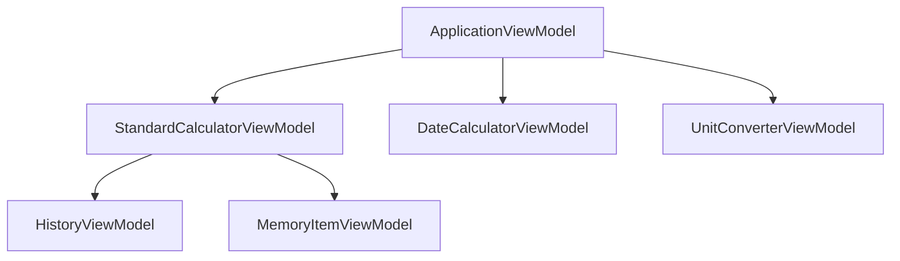
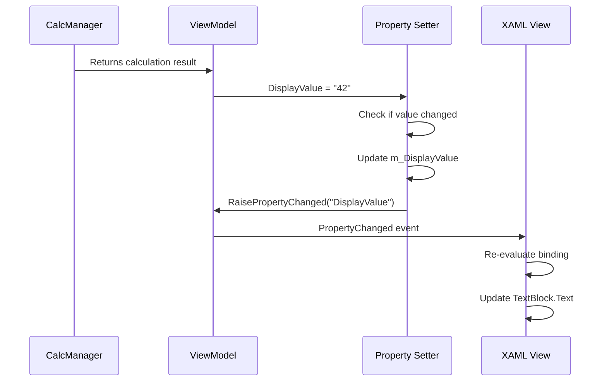

The ViewModel layer is contained in the **CalcViewModel project** and serves as the intermediary between the View (XAML) and Model (CalcManager). ViewModels expose data for UI binding and handle UI-specific logic without coupling to specific UI controls.

## Project Structure

```
src/CalcViewModel/
├── ApplicationViewModel.h
├── StandardCalculatorViewModel.h
├── DateCalculatorViewModel.h
├── UnitConverterViewModel.h
├── HistoryViewModel.h
├── MemoryItemViewModel.h
└── Common/
    ├── Utils.h              # Observable property macros
    ├── DelegateCommand.h
    └── ...
```

## ViewModel Hierarchy

The ViewModel structure mirrors the View hierarchy:



<CardGroup cols={2}>
  <Card title="ApplicationViewModel" icon="sitemap">
    Root ViewModel for `MainPage.xaml`
    
    Manages mode switching and coordinates child ViewModels
  </Card>
  <Card title="StandardCalculatorViewModel" icon="calculator">
    ViewModel for `Calculator.xaml`
    
    Handles Standard, Scientific, and Programmer modes
  </Card>
  <Card title="DateCalculatorViewModel" icon="calendar">
    ViewModel for `DateCalculator.xaml`
    
    Date calculation logic
  </Card>
  <Card title="UnitConverterViewModel" icon="arrows-rotate">
    ViewModel for `UnitConverter.xaml`
    
    All converter modes including currency
  </Card>
</CardGroup>

## Core Responsibilities

ViewModels in Calculator:

<Steps>
  <Step title="Expose Data for Binding">
    Provide properties that XAML elements can bind to
  </Step>
  <Step title="Implement INotifyPropertyChanged">
    Notify the UI when data changes
  </Step>
  <Step title="Transform Model Data">
    Convert Model data into display-friendly formats
  </Step>
  <Step title="Handle Commands">
    Process user actions from the View
  </Step>
  <Step title="Manage UI State">
    Track mode, visibility, enabled state, etc.
  </Step>
</Steps>

## PropertyChanged Events

<Info>
The `INotifyPropertyChanged` interface is the foundation of data binding in MVVM. It allows ViewModels to notify the UI when properties change.
</Info>

### INotifyPropertyChanged Interface

ViewModels implement this interface to support data binding:

```cpp StandardCalculatorViewModel.h Declaration
[Windows::UI::Xaml::Data::Bindable]
public ref class StandardCalculatorViewModel sealed 
    : public Windows::UI::Xaml::Data::INotifyPropertyChanged
{
public:
    StandardCalculatorViewModel();
    
    OBSERVABLE_OBJECT_CALLBACK(OnPropertyChanged);
    // ... properties and methods
};
```

### OBSERVABLE_OBJECT Macro

The `OBSERVABLE_OBJECT()` macro (defined in `Utils.h`) implements the required `PropertyChanged` event:

<CodeGroup>
```cpp Utils.h - OBSERVABLE_OBJECT Macro (src/CalcViewModel/Common/Utils.h:123-131)
#define OBSERVABLE_OBJECT()                                                    \
    virtual event Windows::UI::Xaml::Data::PropertyChangedEventHandler ^ PropertyChanged; \
    internal:                                                                  \
    void RaisePropertyChanged(Platform::String ^ p)                           \
    {                                                                          \
        PropertyChanged(this, ref new Windows::UI::Xaml::Data::PropertyChangedEventArgs(p)); \
    }                                                                          \
                                                                               \
public:
```
</CodeGroup>

This macro:
1. Declares the `PropertyChanged` event
2. Provides a `RaisePropertyChanged` helper function

<Tip>
The `RaisePropertyChanged` function is called whenever a property value changes, triggering UI updates.
</Tip>

## Observable Properties

Calculator uses macros to simplify property declarations that automatically trigger `PropertyChanged` events.

### OBSERVABLE_PROPERTY_RW

Defines a **Read/Write** property with automatic change notification:

<CodeGroup>
```cpp Property Declaration
OBSERVABLE_PROPERTY_RW(Platform::String^, CategoryName);
```

```cpp Macro Expansion (src/CalcViewModel/Common/Utils.h:77-97)
#define OBSERVABLE_PROPERTY_RW(t, n)                                          \
    property t n                                                              \
    {                                                                         \
        t get()                                                               \
        {                                                                     \
            return m_##n;                                                     \
        }                                                                     \
        void set(t value)                                                     \
        {                                                                     \
            if (m_##n != value)                                               \
            {                                                                 \
                m_##n = value;                                                \
                RaisePropertyChanged(L#n);                                    \
            }                                                                 \
        }                                                                     \
    }                                                                         \
                                                                              \
private:                                                                      \
    t m_##n;                                                                  \
                                                                              \
public:
```
</CodeGroup>

<Note>
The setter checks if the new value differs from the current value before raising `PropertyChanged`, avoiding unnecessary events.
</Note>

### OBSERVABLE_PROPERTY_R

Defines a **Read-Only** property (setter is private):

```cpp Read-Only Property
OBSERVABLE_PROPERTY_R(HistoryViewModel^, HistoryVM);
```

Use this for properties that should only be modified internally by the ViewModel.

### Property Examples from StandardCalculatorViewModel

<CodeGroup>
```cpp StandardCalculatorViewModel.h Properties (src/CalcViewModel/StandardCalculatorViewModel.h:40-86)
OBSERVABLE_OBJECT_CALLBACK(OnPropertyChanged);
OBSERVABLE_PROPERTY_RW(Platform::String ^, DisplayValue);
OBSERVABLE_PROPERTY_R(HistoryViewModel ^, HistoryVM);
OBSERVABLE_PROPERTY_RW(bool, IsAlwaysOnTop);
OBSERVABLE_PROPERTY_R(bool, IsBinaryBitFlippingEnabled);
OBSERVABLE_NAMED_PROPERTY_R(bool, IsInError);
OBSERVABLE_PROPERTY_R(bool, IsOperatorCommand);
OBSERVABLE_PROPERTY_R(
    Windows::Foundation::Collections::IObservableVector<Common::DisplayExpressionToken ^> ^, 
    ExpressionTokens
);
OBSERVABLE_PROPERTY_R(Platform::String ^, DecimalDisplayValue);
OBSERVABLE_PROPERTY_R(Platform::String ^, HexDisplayValue);
OBSERVABLE_PROPERTY_R(Platform::String ^, OctalDisplayValue);
OBSERVABLE_NAMED_PROPERTY_R(Platform::String ^, BinaryDisplayValue);
OBSERVABLE_PROPERTY_R(bool, IsBinaryOperatorEnabled);
OBSERVABLE_PROPERTY_R(bool, IsMemoryEmpty);
```
</CodeGroup>

## Data Binding Flow

Here's how property changes flow to the UI:



### Example: Display Value Update

<Tabs>
  <Tab title="ViewModel Property">
    ```cpp StandardCalculatorViewModel.h
    OBSERVABLE_PROPERTY_RW(Platform::String ^, DisplayValue);
    ```
    
    This expands to a property with automatic change notification.
  </Tab>
  
  <Tab title="XAML Binding">
    ```xml Calculator.xaml
    <TextBlock Text="{x:Bind Model.DisplayValue, Mode=OneWay}"/>
    ```
    
    The UI binds to the `DisplayValue` property.
  </Tab>
  
  <Tab title="Update Flow">
    1. Model performs calculation
    2. ViewModel receives result
    3. ViewModel sets `DisplayValue = "42"`
    4. Property setter compares values
    5. If different, updates `m_DisplayValue`
    6. Calls `RaisePropertyChanged(L"DisplayValue")`
    7. UI receives `PropertyChanged` event
    8. Binding re-evaluates and updates TextBlock
  </Tab>
</Tabs>

## Commands

ViewModels expose commands for user actions using the `COMMAND_FOR_METHOD` macro.

### Command Declaration

<CodeGroup>
```cpp StandardCalculatorViewModel.h Commands (src/CalcViewModel/StandardCalculatorViewModel.h:88-94)
COMMAND_FOR_METHOD(CopyCommand, StandardCalculatorViewModel::OnCopyCommand);
COMMAND_FOR_METHOD(PasteCommand, StandardCalculatorViewModel::OnPasteCommand);
COMMAND_FOR_METHOD(ButtonPressed, StandardCalculatorViewModel::OnButtonPressed);
COMMAND_FOR_METHOD(ClearMemoryCommand, StandardCalculatorViewModel::OnClearMemoryCommand);
COMMAND_FOR_METHOD(MemoryItemPressed, StandardCalculatorViewModel::OnMemoryItemPressed);
COMMAND_FOR_METHOD(MemoryAdd, StandardCalculatorViewModel::OnMemoryAdd);
COMMAND_FOR_METHOD(MemorySubtract, StandardCalculatorViewModel::OnMemorySubtract);
```
</CodeGroup>

### COMMAND_FOR_METHOD Macro

<CodeGroup>
```cpp Utils.h - Command Macro (src/CalcViewModel/Common/Utils.h:170-188)
#define COMMAND_FOR_METHOD(p, m)                                              \
    property Windows::UI::Xaml::Input::ICommand ^ p                           \
    {                                                                         \
        Windows::UI::Xaml::Input::ICommand ^ get()                            \
        {                                                                     \
            if (!donotuse_##p)                                                \
            {                                                                 \
                donotuse_##p = ref new CalculatorApp::ViewModel::Common::DelegateCommand( \
                    CalculatorApp::ViewModel::Common::MakeDelegateCommandHandler(this, &m) \
                );                                                            \
            }                                                                 \
            return donotuse_##p;                                              \
        }                                                                     \
    }                                                                         \
                                                                              \
private:                                                                      \
    Windows::UI::Xaml::Input::ICommand ^ donotuse_##p;                        \
                                                                              \
public:
```
</CodeGroup>

### Command Binding in XAML

```xml MainPage.xaml Command Binding
<Button x:Name="CopyButton"
        Command="{x:Bind Model.CopyCommand}"/>
```

When the button is clicked, the command executes `OnCopyCommand` in the ViewModel.

## ViewModel-Model Interaction

ViewModels call into the Model layer through `CalculatorManager`:

```cpp ViewModel → Model Flow
// ViewModel holds a reference to CalculatorManager
private:
    CalculationManager::CalculatorManager* m_calculatorManager;

// ViewModel calls Model for calculations
void StandardCalculatorViewModel::OnButtonPressed(Object^ parameter)
{
    // Process button press
    auto command = GetCommandFromParameter(parameter);
    
    // Delegate to Model
    m_calculatorManager->SendCommand(command);
    
    // Model will call back via ICalcDisplay interface
    // which updates ViewModel properties
}
```

<Info>
The Model communicates back to the ViewModel through the `ICalcDisplay` interface, which the ViewModel implements.
</Info>

## Complex Property Example

Some properties have custom logic beyond simple get/set:

```cpp StandardCalculatorViewModel.h Custom Property (src/CalcViewModel/StandardCalculatorViewModel.h:98-114)
property bool IsBitFlipChecked
{
    bool get()
    {
        return m_isBitFlipChecked;
    }
    void set(bool value)
    {
        if (m_isBitFlipChecked != value)
        {
            m_isBitFlipChecked = value;
            
            // Update related properties
            IsBinaryBitFlippingEnabled = IsProgrammer && m_isBitFlipChecked;
            AreProgrammerRadixOperatorsVisible = IsProgrammer && !m_isBitFlipChecked;
            
            RaisePropertyChanged(L"IsBitFlipChecked");
        }
    }
}
```

This property updates multiple dependent properties when changed.

## Best Practices

<AccordionGroup>
  <Accordion title="Use Observable Macros">
    Use `OBSERVABLE_PROPERTY_RW` or `OBSERVABLE_PROPERTY_R` for properties that trigger UI updates. This ensures consistent behavior and reduces boilerplate.
  </Accordion>
  
  <Accordion title="Check Value Changes">
    Always check if the new value differs before raising `PropertyChanged` to avoid unnecessary UI updates. The macros handle this automatically.
  </Accordion>
  
  <Accordion title="No UI References">
    ViewModels should never reference XAML controls or UI-specific types. Use data binding and commands instead.
  </Accordion>
  
  <Accordion title="Transform for Display">
    Convert Model data into display-friendly formats in the ViewModel. For example, format numbers with appropriate precision.
  </Accordion>
  
  <Accordion title="Use Read-Only Properties">
    Prefer `OBSERVABLE_PROPERTY_R` for properties that shouldn't be modified by the View.
  </Accordion>
</AccordionGroup>

## Property Change Callbacks

Use `OBSERVABLE_OBJECT_CALLBACK` to react to any property change:

```cpp Callback Example
OBSERVABLE_OBJECT_CALLBACK(OnPropertyChanged);

private:
void OnPropertyChanged(Platform::String^ propertyName)
{
    // React to specific property changes
    if (propertyName == L"DisplayValue")
    {
        // Update accessibility announcements, etc.
    }
}
```

## Testing ViewModels

<Tip>
ViewModels are highly testable because they don't depend on UI:

```cpp Example Unit Test
// Create ViewModel
auto vm = ref new StandardCalculatorViewModel();

// Set property
vm->DisplayValue = "123";

// Verify
Assert::AreEqual("123", vm->DisplayValue);
```
</Tip>

## Next Steps

<CardGroup cols={3}>
  <Card title="Model Layer" icon="gears" href="./model-layer">
    Understand how ViewModels interact with CalcManager
  </Card>
  <Card title="View Layer" icon="window" href="./view-layer">
    See how XAML binds to ViewModel properties
  </Card>
  <Card title="MVVM Pattern" icon="diagram-project" href="./mvvm-pattern">
    Review the overall architecture pattern
  </Card>
</CardGroup>