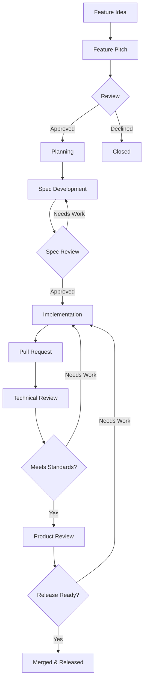

Windows Calculator follows a user-centered process for developing features. This guide explains how features progress from initial idea to finished product.

## Overview

New features need sponsorship from the Calculator team, but we welcome community contributions at many stages of the process. The [Feature Tracking board](https://github.com/Microsoft/calculator/projects/1) shows all the features we're working on and their current status.

<Note>
  You **do not** need to follow this process for bug fixes, performance improvements, or changes to development tools. For those changes, discuss the proposal in an issue and submit a pull request.
</Note>

<Warning>
  You **do** need to follow this process for any change which "users will notice". This applies especially to new features and major visual changes.
</Warning>

## Where to Submit Ideas

The easiest way to submit new feature requests is through [Feedback Hub](https://insider.windows.com/en-us/fb/?contextid=130).

### Why Feedback Hub?

- Any Windows user can upvote suggestions (even without GitHub)
- The Calculator team reviews suggestions regularly
- Top ideas become [feature pitch issues on GitHub](https://github.com/Microsoft/calculator/issues?q=is%3Aissue+is%3Aopen+project%3AMicrosoft%2Fcalculator%2F1)

<Accordion title="Can I create feature pitches directly on GitHub?">
  Yes! You don't have to use Feedback Hub - you can create feature pitches directly on GitHub. This document explains what makes a good pitch and how features progress from pitch to finished product.
</Accordion>

## Step 1: Feature Pitch

Feature pitches are submitted as issues on GitHub using the [Feature Request template](https://github.com/Microsoft/calculator/issues/new?assignees=&labels=&template=feature_request.md&title=).

### Creating a Good Pitch

A good feature pitch includes:

- **Problem statement**: What user need does this address?
- **Proposed solution**: How would this feature work?
- **User scenarios**: Who would use this and how?
- **Alternatives considered**: What other approaches were considered?

<Note>
  We encourage discussion on open issues. As discussion progresses, we will edit the issue description to refine the idea until it is ready for review.
</Note>

### Review and Approval

We review pitches regularly and will approve or close issues based on whether they broadly align with the [Calculator roadmap](https://github.com/Microsoft/calculator/blob/master/docs/Roadmap.md).

- **Approved pitches**: Moved into [Planning](https://github.com/Microsoft/calculator/projects/1) on the feature tracking board
- **Declined pitches**: Closed with explanation

## Step 2: Planning

For most features, the output of this phase is a specification describing how the feature will work, supported by design renderings and code prototypes as needed.

### Specification Process

- The original issue continues to track overall progress
- Spec documentation is created and iterated in the [Calculator Spec repo](https://github.com/Microsoft/calculator-specs)
- Sometimes we learn new things during planning that lead to editing or closing the original pitch

<Accordion title="Community Participation in Planning">
  We welcome community participation throughout planning. The best ideas often come from trying many ideas during the planning phase.
  
  To enable rapid experimentation, we encourage developing and sharing rough ideas - maybe even with pencil and paper - before making designs pixel-perfect or making code robust and maintainable.
  
  **Ways to contribute during planning:**
  - Share design mockups or prototypes
  - Provide feedback on proposed specs
  - Test early prototypes
  - Suggest alternative approaches
</Accordion>

### Moving to Implementation

After [spec review](https://github.com/Microsoft/calculator-specs#spec-review) is completed, issues move to [Implementation](https://github.com/Microsoft/calculator/projects/1) on the feature tracking board.

<Note>
  In some cases, all details can be captured concisely in the original feature pitch. When that happens, we may move ideas directly into implementation without a separate spec.
</Note>

## Step 3: Implementation

A feature can be implemented by the original submitter, a Microsoft team member, or by other community members.

### Getting Started

1. Comment on the issue to let everyone know you're working on it (helps avoid duplicated effort)
2. You might be able to reuse code from prototypes, but it typically needs more work to be robust
3. Follow the [code style guidelines](/contributing/code-style)
4. Submit [pull requests](/contributing/pull-requests) when ready

<Note>
  Code contributions and testing help are greatly appreciated!
</Note>

### Technical Review

As with all changes, code for new features will be reviewed by a member of the Microsoft team before being checked in to the master branch.

<Warning>
  New features often need a more thorough technical review than bug fixes. The Microsoft team considers many items to ensure quality and compatibility.
</Warning>

## Technical Review Checklist

When reviewing code for new features, the Microsoft team considers at least these items:

### Accessibility

<Accordion title="Accessibility Checklist">
  All items on the [Accessibility checklist](https://docs.microsoft.com/en-us/windows/uwp/design/accessibility/accessibility-checklist) should be addressed:
  
  - Keyboard navigation works properly
  - Screen readers can access all functionality
  - High contrast themes are supported
  - Focus indicators are visible
  - Text meets minimum size requirements
  - Color is not the only means of conveying information
</Accordion>

### Globalization

<Accordion title="Globalization Checklist">
  All items on the [Globalization checklist](https://docs.microsoft.com/en-us/windows/uwp/design/globalizing/guidelines-and-checklist-for-globalizing-your-app) should be addressed:
  
  - All user-facing strings are localizable
  - Layout supports right-to-left languages
  - Number, date, and currency formatting respect user locale
  - Text can expand for longer translations
  - No hardcoded cultural assumptions
</Accordion>

### Platform Compatibility

- Test on the oldest supported Windows version (found in AppxManifest.xml)
- Any calls to newer APIs must be [conditionally enabled](https://docs.microsoft.com/en-us/windows/uwp/debug-test-perf/version-adaptive-apps)
- Only supported APIs are used (verify with [Windows App Certification Kit](https://docs.microsoft.com/en-us/windows/uwp/debug-test-perf/windows-app-certification-kit))

### App Lifecycle

<Accordion title="Suspend and Resume">
  The change should save the user's progress if the app is [suspended and resumed](https://docs.microsoft.com/en-us/windows/uwp/debug-test-perf/optimize-suspend-resume).
  
  Code to handle these cases should be [tested in the Visual Studio debugger](https://docs.microsoft.com/en-us/visualstudio/debugger/how-to-trigger-suspend-resume-and-background-events-for-windows-store-apps-in-visual-studio).
  
  **What to test:**
  - User data is preserved when app suspends
  - State is correctly restored on resume
  - No data loss during suspend/resume cycle
</Accordion>

### Device Families

- If the change [has customizations for particular device families](https://docs.microsoft.com/en-us/uwp/extension-sdks/device-families-overview), test on those device families
- Test with app window resized to smallest possible size

### Visual Design

<Accordion title="Theme and Display Testing">
  Test the change with:
  
  - **Light theme**: Default appearance
  - **Dark theme**: Dark mode support
  - **High contrast themes**: All high contrast options
  - **Accent color**: Should honor user's preferred [accent color](https://docs.microsoft.com/en-us/windows/uwp/design/style/color#accent-color-palette)
  
  Ensure UI remains usable and visually correct in all themes.
</Accordion>

### Dependencies

<Accordion title="New Libraries or Dependencies">
  If the change adds new libraries or other dependencies:
  
  **If packaged with the app:**
  - Measure the increased size of the binaries
  - Ensure size increase is justified
  
  **If not maintained by Microsoft:**
  - Set up a plan to monitor the upstream library
  - Watch for security fixes and updates
  - Evaluate long-term maintenance commitment
  
  **If open-source:**
  - Comply with the library's license
  - Credit third parties appropriately
  - Review license compatibility
</Accordion>

### Performance

<Accordion title="Startup Performance">
  If the change adds code to the app's startup path, or adds new XAML elements loaded at startup:
  
  - Run the perf tests to measure any increase in startup time
  - Move work out of the startup path if possible
  - Consider lazy loading for non-critical components
  - Profile and optimize hot paths
</Accordion>

### Logging

<Accordion title="Telemetry and Logging">
  If the change adds additional logging:
  
  - All logging should use [TraceLogging](https://docs.microsoft.com/en-us/windows/desktop/tracelogging/trace-logging-about)
  - Unnecessary log events should be removed
  - Configure events so they're collected only when needed
  - Don't log sensitive user data
  - Ensure logging doesn't impact performance
</Accordion>

### Data Compatibility

<Accordion title="Backward Compatibility">
  If the change reads user data from files or app settings:
  
  - Verify that state saved in a previous version can be used with the new version
  - Test migration from old data formats
  - Handle missing or corrupted data gracefully
  - Don't break user data from older versions
</Accordion>

### Network Requests

<Accordion title="Network Dependencies">
  If the change makes network requests:
  
  **Long-term support:**
  - Microsoft must plan to keep these dependencies secure and functional for the lifetime of the app (possibly several years)
  
  **Reliability:**
  - App should be fully functional if some network requests are slow or fail
  - Test with tools like [Fiddler](https://docs.telerik.com/fiddler/knowledgebase/fiddlerscript/perftesting) to simulate slow or failed requests
  - Implement appropriate timeouts and retry logic
  - Provide meaningful error messages to users
</Accordion>

## Step 4: Final Product Review

After the technical review is complete, the product team will review the finished product to ensure the final implementation is ready to release to Windows customers.

### What's Evaluated

- Feature completeness against the spec
- User experience quality
- Visual polish
- Documentation completeness
- Release readiness

<Note>
  For more information about releases, see the [Calculator Roadmap](https://github.com/Microsoft/calculator/blob/master/docs/Roadmap.md#Releases).
</Note>

## Summary: The Feature Journey

<Warning>
  This process ensures features meet high quality standards, but it means the path from idea to release can be lengthy. Patience and collaboration are key to successful feature contributions.
</Warning>
